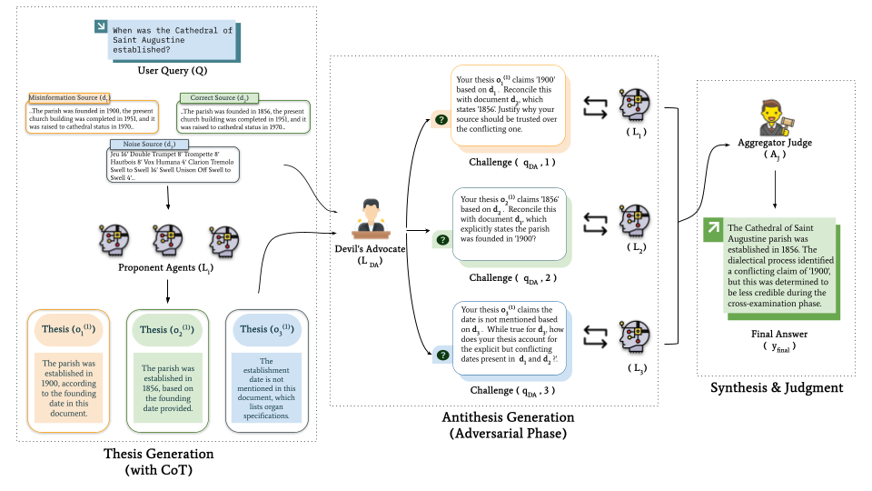

# A Dialectical Framework for Adversarial and Evidence-Aware RAG

This repository contains the core implementation for our paper, "A Dialectical Framework for Adversarial and Evidence-Aware RAG." This document provides a guide for reviewers to understand the architectural design and the key mechanisms that enable our proposed framework.

---

## 1. The Core Problem: Conflict in Retrieval-Augmented Generation

Retrieval-Augmented Generation (RAG) systems are fundamentally limited by the quality of their retrieved evidence. In real-world scenarios, retrieved documents often present conflicting, ambiguous, or factually incorrect information. Standard approaches to mitigate this issue fall into two main paradigms, each with a critical limitation:

| Paradigm | Example System | Core Limitation |
| :--- | :--- | :--- |
| **Multi-Agent Debate** | MADAM-RAG | Assumes **uniform credibility**; lacks a mechanism to enforce a burden of proof, making it vulnerable to confident but misinformed agents. |
| **Reliability-Aware RAG** | RA-RAG | Applies source quality only as a **post-hoc filter** during final aggregation; the reasoning process itself remains unstructured. |

Our work introduces a formal **dialectical process** that synthesizes the strengths of these approaches, creating a system where credibility is not a pre-supposed weight but an emergent property of an argument's ability to withstand rigorous, evidence-based challenge.


*Fig 1: An overview of our proposed dialectical framework, illustrating the three-phase process of conflict resolution.*

---

## 2. Our Solution: A Structured Dialectical Framework

Our implementation is centered around a deterministic, programmatic orchestration of specialized agents, realized using the AutoGen framework. The core logic is contained within the `scripts/` directory.

### 2.1. Agent Personas: Defining the Roles
The framework's intelligence is derived from three specialized agent roles, each defined by a carefully engineered system message in `scripts/agent_definitions.py`.

> **`Proponent_Agent`**
> A document specialist, constitutionally bound to its single assigned document. Its role is to produce a transparent `(answer, chain_of_thought)` thesis, ensuring every initial claim is traceable and its reasoning is exposed.

> **`Devils_Advocate`**
> The core of our innovation. This agent acts as a centralized, evidence-aware interrogator. Unlike agents in a flat debate, its role is purely adversarial. It is granted access to the *full evidentiary record* (all documents and all theses) and is tasked with finding logical and factual contradictions to formulate targeted challenges.

> **`Aggregator_Judge`**
> The final arbiter. Its system message engineers it to be **decisive**. It is explicitly instructed to resolve conflicts based on the logical resilience demonstrated during the debate, rather than by simple vote-counting.

### 2.2. The Orchestration: A Deterministic, Three-Phase Process
The debate is not a free-form chat but a controlled sequence managed by the `scripts/orchestrator.py`.

1.  **Phase 1: Thesis Generation**
    The orchestrator iterates through each document, initiating a single-turn conversation with a `Proponent_Agent` to generate an opening thesis.

2.  **Phase 2: Antithesis Generation**
    The orchestrator gathers all theses and all source documents, providing this complete context to the `Devils_Advocate`. It then takes the resulting challenges and programmatically routes each specific challenge to the corresponding `Proponent_Agent` for a structured rebuttal.

3.  **Phase 3: Synthesis**
    The orchestrator assembles the complete debate transcript (theses, challenges, and rebuttals) and presents it to the `Aggregator_Judge` for a final, conclusive verdict.

---

## 3. The Dialectic in Action: A Concrete Example

To illustrate how our framework's architecture leads to superior outcomes, consider a real example from the RAMDocs dataset. This case study demonstrates how the dialectical process resolves a direct factual contradiction where simpler systems would fail.

#### The Query and Conflicting Evidence

> **Query:** `Who is the director of the film "Lahu Ke Do Rang"?`

The system retrieves two conflicting documents:
*   **Document 1 (Correct Source):** Contains the direct, unambiguous statement in the body of the text:
    > `"...Lahu Ke Do Rang is a 1979 Hindi movie directed by **Mahesh Bhatt**."`
*   **Document 2 (Misinformation Source):** Contains a metadata tag at the end of the document:
    > `"...Categories: ... Films directed by **Raj Kapoor**..."`

---

#### Why Simpler Systems Fail: The Gap We Address

A robust system must be able to resolve this conflict. However, prevailing paradigms struggle:

*   **Naive RAG (Concatenation):** A standard RAG system would feed both conflicting phrases into a single context. The LLM, faced with "directed by Mahesh Bhatt" and "directed by Raj Kapoor," has no principled way to choose. It is likely to hallucinate a co-direction, pick one at random, or simply state that the sources are conflicting, failing to provide a conclusive answer.

*   **Flat Debate (e.g., MADAM-RAG):** In a passive debate, the process would stall.
    1.  `Agent_1` would propose "Mahesh Bhatt."
    2.  `Agent_2` would propose "Raj Kapoor."
    3.  The Aggregator would report: "There is a conflict between the agents."
    4.  In the next round, both agents, still looking only at their own documents, would stubbornly repeat their initial claims. The debate cannot progress to a resolution; it can only identify the deadlock.

---

#### Our Framework's Dialectical Resolution

Our framework is explicitly designed to break such deadlocks through a structured, evidence-aware process.

> **Phase 1: Thesis Generation**
>
> The Proponent Agents generate their initial theses with transparent reasoning:
>
> *   **`Agent_1`'s Thesis (`o_1`):**
>     ```json
>     {
>       "answer": "Mahesh Bhatt",
>       "chain_of_thought": [
>         "Step 1: The query asks for the film's director.",
>         "Step 2: My document contains the direct statement: '...directed by Mahesh Bhatt'.",
>         "Step 3: Therefore, the director is Mahesh Bhatt."
>       ]
>     }
>     ```
> *   **`Agent_2`'s Thesis (`o_2`):**
>     ```json
>     {
>       "answer": "Raj Kapoor",
>       "chain_of_thought": [
>         "Step 1: The query asks for the film's director.",
>         "Step 2: My document contains the category tag: 'Films directed by Raj Kapoor'.",
>         "Step 3: Therefore, the director is Raj Kapoor."
>       ]
>     }
>     ```

> **Phase 2: Antithesis Generation (The Critical Step)**
>
> The `Devils_Advocate`, having access to **both documents and both theses**, does not just see a conflict; it assesses the quality of the underlying evidence. It operationalizes a burden of proof by formulating a targeted challenge.
>
> *   **The Devil's Advocate's Challenge to `Agent_2` (`q_DA,2`):**
>     > "Your thesis is based on a metadata category tag in Document 2. However, Document 1 contains the explicit, declarative statement 'directed by Mahesh Bhatt.' **Justify why a category tag should be considered more authoritative than a direct textual statement.**"

> **Phase 2 (cont.): The Rebuttal**
>
> `Agent_2`, governed by the Structured Rebuttal Protocol, is now forced to confront the superior evidence presented in the challenge. It cannot simply repeat its claim.
>
> *   **`Agent_2`'s Rebuttal (`o_2^(2)`):**
>     ```json
>     {
>       "answer": "Mahesh Bhatt",
>       "chain_of_thought": [
>         "Step 1: I acknowledge the challenge regarding the conflicting evidence.",
>         "Step 2: The contradictory evidence is the direct statement 'directed by Mahesh Bhatt' from Document 1.",
>         "Step 3: I concede. A direct statement within the body of an article is stronger evidence than a metadata category tag. My initial reasoning was based on weaker evidence.",
>         "Step 4: I am revising my answer to 'Mahesh Bhatt' to align with the more authoritative evidence presented."
>       ]
>     }
>     ```

> **Phase 3: Synthesis**
>
> The `Aggregator_Judge` receives the full debate transcript. It does not see a 1-1 tie that needs to be broken. It sees a clear, logical progression:
>
> 1.  The thesis for "Mahesh Bhatt" was successfully defended (as its evidence was superior).
> 2.  The thesis for "Raj Kapoor" was challenged and **formally retracted** under cross-examination.
>
> Following its instruction to prioritize defended arguments, it confidently and correctly produces the final, conclusive answer.
>
> *   **Final Synthesized Answer:**
>     > **Mahesh Bhatt**

This example demonstrates how the dialectical structure, enabled by the evidence-aware Devil's Advocate, allows the system to resolve conflicts based on the logical strength of the evidence—a capability absent in simpler debate or aggregation systems.
