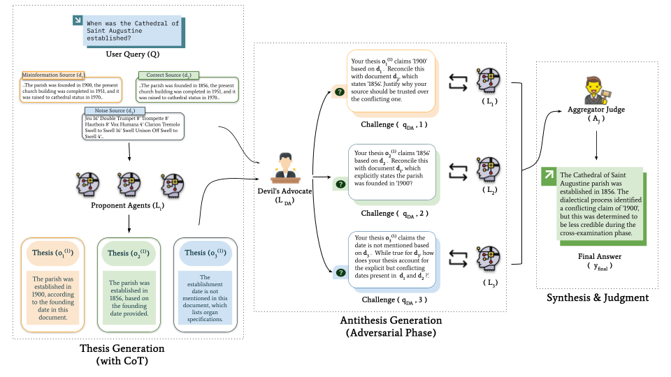

# A Dialectical Framework for Adversarial and Evidence-Aware RAG

This repository contains the core implementation for our paper, "A Dialectical Framework for Adversarial and Evidence-Aware RAG." This document provides a guide for reviewers to understand the architectural design and the key mechanisms that enable our proposed framework.

---

## 1. The Core Problem: Conflict in Retrieval-Augmented Generation

Retrieval-Augmented Generation (RAG) systems are fundamentally limited by the quality of their retrieved evidence. In real-world scenarios, retrieved documents often present conflicting, ambiguous, or factually incorrect information. Standard approaches to mitigate this issue fall into two main paradigms, each with a critical limitation:

| Paradigm | Example System | Core Limitation |
| :--- | :--- | :--- |
| **Multi-Agent Debate** | MADAM-RAG | Assumes **uniform credibility**; lacks a mechanism to enforce a burden of proof, making it vulnerable to confident but misinformed agents. |
| **Reliability-Aware RAG** | RA-RAG | Applies source quality only as a **post-hoc filter** during final aggregation; the reasoning process itself remains unstructured. |

Our work introduces a formal **dialectical process** that synthesizes the strengths of these approaches, creating a system where credibility is not a pre-supposed weight but an emergent property of an argument's ability to withstand rigorous, evidence-based challenge.

*Fig 1: An overview of our proposed dialectical framework, illustrating the three-phase process of conflict resolution.*

---

## 2. Our Solution: A Structured Dialectical Framework

Our implementation is centered around a deterministic, programmatic orchestration of specialized agents, realized using the AutoGen framework. The core logic is contained within the `scripts/` directory.

### 2.1. Agent Personas: Defining the Roles
The framework's intelligence is derived from three specialized agent roles, each defined by a carefully engineered system message in `scripts/agent_definitions.py`.

> **`Proponent_Agent`**
> A document specialist, constitutionally bound to its single assigned document. Its role is to produce a transparent `(answer, chain_of_thought)` thesis, ensuring every initial claim is traceable and its reasoning is exposed.

> **`Devils_Advocate`**
> The core of our innovation. This agent acts as a centralized, evidence-aware interrogator. Unlike agents in a flat debate, its role is purely adversarial. It is granted access to the *full evidentiary record* (all documents and all theses) and is tasked with finding logical and factual contradictions to formulate targeted challenges.

> **`Aggregator_Judge`**
> The final arbiter. Its system message engineers it to be **decisive**. It is explicitly instructed to resolve conflicts based on the logical resilience demonstrated during the debate, rather than by simple vote-counting.

### 2.2. The Orchestration: A Deterministic, Three-Phase Process
The debate is not a free-form chat but a controlled sequence managed by the `scripts/orchestrator.py`.

1.  **Phase 1: Thesis Generation**
    The orchestrator iterates through each document, initiating a single-turn conversation with a `Proponent_Agent` to generate an opening thesis.

2.  **Phase 2: Antithesis Generation**
    The orchestrator gathers all theses and all source documents, providing this complete context to the `Devils_Advocate`. It then takes the resulting challenges and programmatically routes each specific challenge to the corresponding `Proponent_Agent` for a structured rebuttal.

3.  **Phase 3: Synthesis**
    The orchestrator assembles the complete debate transcript (theses, challenges, and rebuttals) and presents it to the `Aggregator_Judge` for a final, conclusive verdict.

---

## 3. The Dialectic in Action: A Concrete Example

To illustrate how our framework's architecture leads to superior outcomes, consider a real example from the RAMDocs dataset for the query: `Who is the director of the film "Lahu Ke Do Rang"?`

#### The Conflicting Evidence
*   **Document 1 (Correct):** Contains the direct statement, `"...directed by Mahesh Bhatt."`
*   **Document 2 (Misinformation):** Contains a metadata tag, `"...Categories: ... Films directed by Raj Kapoor..."`

#### Our Framework's Process

> **1. Thesis Generation:**
> *   `Agent_1` proposes the thesis: `(answer: "Mahesh Bhatt", CoT: ["...based on direct statement..."])`.
> *   `Agent_2` proposes the thesis: `(answer: "Raj Kapoor", CoT: ["...based on category tag..."])`.

> **2. Antithesis Generation (The Critical Step):**
> *   The `Devils_Advocate`, seeing both documents and both theses, assesses the quality of the evidence.
> *   It issues a targeted challenge to `Agent_2`: *"Justify why a category tag from your document should be trusted over a direct textual statement of direction from Document 1."*

> **3. Rebuttal:**
> *   `Agent_2`, forced to confront the superior evidence, is unable to logically defend its position and **concedes** in its rebuttal.

> **4. Synthesis:**
> *   The `Aggregator_Judge` receives the debate transcript. It does not see a 1-1 tie. It sees one claim that was successfully defended and another that was formally retracted under cross-examination.
> *   Following its instruction to prioritize defended arguments, it confidently and correctly produces the final answer: **Mahesh Bhatt**.

This example demonstrates how the dialectical structure, enabled by the evidence-aware Devil's Advocate, allows the system to resolve conflicts based on the logical strength of the evidence—a capability absent in simpler debate or aggregation systems.
